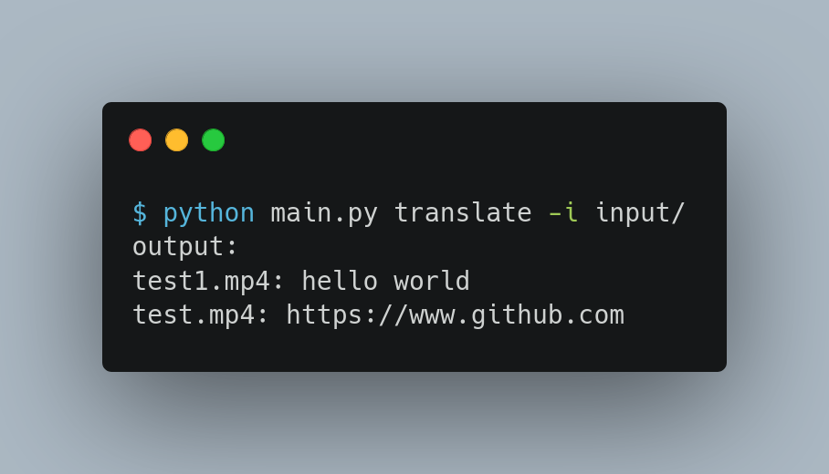

# Sign2Text
Sign2Text is an innovative AI-powered tool designed to bridge the communication gap between individuals who use sign language and those who do not. Leveraging advanced technologies such as Google's MediaPipe for hand and body keypoint recognition, and a state-of-the-art Transformer model for sequence modeling, Sign2Text accurately translates sign language gestures into text in real-time.
## Requirements
- Python 3.10
- TensorFlow
- tensorflow==2.12.0
- mediapipe==0.10.11
- opencv-python==4.9.0.80
- numpy==1.23.5
## Installation
1. Clone the repository or extract the project files.
2. Install the required packages using `pip`:
```bash
pip install -r requirements.txt
```
3. Ensure that the `model/`, `V2T.py`, `Model.py`, and `videos/` directories are correctly structured and contain the necessary files.
## Project Structure
The project directory can be structured as follows:
```
├── data
│   ├── label.txt
│   └── test.mp4
├── input
│   ├── test1.mp4
│   └── test.mp4
├── main.py
├── model
│   ├── character_to_prediction_index.json
│   ├── hand_landmarker.task
│   ├── pose_landmarker_full.task
│   ├── Sign2Text-base.tflite
│   └── Sign2Text-large.tflite
├── Model.py
└── V2T.py

```
- `main.py`: The entry point of the CLI tool, containing the `click` commands for `translate` and `dataset`.
- `V2T.py`: Contains the `video2text` function for processing input videos and extracting features.
- `Model.py`: Contains the `Model` class for loading the specified model and performing predictions.
- `model/`: Directory containing pre-trained models (`base.h5` and `large.h5`) for translation.
- `videos/`: Directory containing input videos for translation.
## Usage
To use Sign2Text, navigate to the project directory and execute the following commands:
### Translate Command
Translate sign language videos using the specified model and output the results in the desired format.
Usage:
```bash
python main.py translate -m [model] -f [format] -i [input]
```
Example:
```bash
python main.py translate -m base -f txt -i input
```
Options:
- `-m`: The model to use for translation (`base` or `large`).
- `-f`: The output format (`cli`, `csv`, or `txt`).
- `-i`: The input file or directory path.

### Dataset Command
Process a directory of training data and convert it into a TensorFlow `TFRecord` file for model training.
Usage:
```bash
python main.py dataset -i [input_directory]
```
Example:
```bash
python main.py dataset -i data
```
Options:
- `-i`: The directory where the training data is stored.

## Contributing
Contributions to Sign2Text are welcome! Please follow the guidelines mentioned in the `CONTRIBUTING.md` file.
## License

Sign2Text is licensed under the [MIT License](LICENSE). See the [LICENSE](LICENSE) file for more information.

Happy signing!
